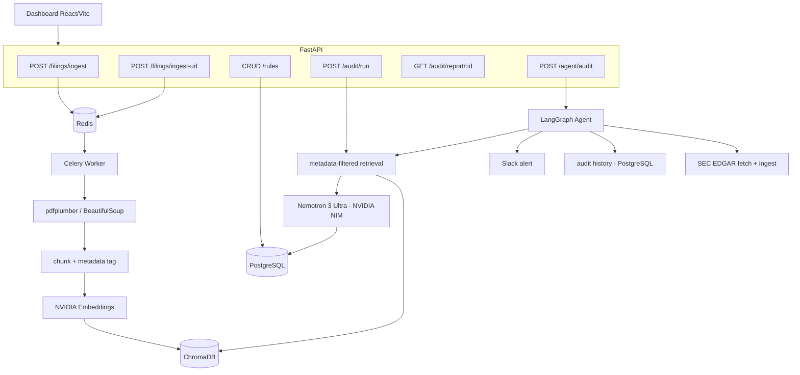
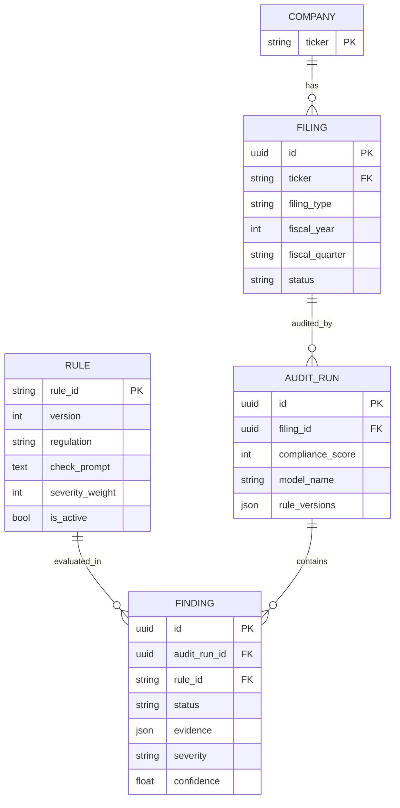

# Automated FinTech Corporate Compliance Auditor

Backend + minimal dashboard that ingests financial-sector filings (10-K/10-Q PDFs or SEC URLs), isolates data per company/period in ChromaDB, audits statements against API-managed compliance rules (SOX/AML/KYC) using **metadata-filtered RAG + structured LLM reasoning on NVIDIA NIM (Nemotron)**, produces risk-scored audit reports (JSON + PDF), and runs a LangGraph agent that fetches filings from SEC EDGAR, queries audit history, and sends Slack alerts on critical findings.

> **Scope:** built for **financial-sector** filings (banks, payments, fintechs) where AML/KYC/SOX disclosures apply (e.g. PayPal, Coinbase, SoFi, Robinhood).

## Stack
- **LLM (NVIDIA NIM)**: `nvidia/nemotron-3-ultra-550b-a55b` for compliance reasoning (controllable reasoning budget); provider-switchable to Anthropic/OpenAI via `LLM_PROVIDER`
- **Embeddings (NVIDIA NIM)**: `nvidia/nemotron-3-embed-1b` (2048-dim), passage/query aware
- **API**: FastAPI (async), Pydantic v2
- **Async jobs**: Celery + Redis
- **DBs**: PostgreSQL (rules, filings, audits, findings), ChromaDB (vectors + metadata)
- **RAG**: LangChain + ChromaDB, metadata-filtered retrieval, structured JSON findings
- **Agent**: LangGraph (SEC EDGAR fetch → ingest → audit → history → alert); `mcp.json` provided to expose the tools to MCP clients
- **Reports**: WeasyPrint (PDF) + JSON
- **Frontend**: React + Vite + TypeScript

## Quick start
```bash
cp .env.example .env          # fill in NVIDIA_API_KEY and API_KEY
docker compose up -d --build  # api, worker, postgres, redis, chromadb
docker compose exec api python scripts/seed.py   # seed rules + demo company
# API docs: http://localhost:8000/docs   |   health: http://localhost:8000/health
```
Dashboard (separate terminal):
```bash
cd frontend && npm install && npm run dev   # http://localhost:5173
```

## Architecture


## Data model


## Key design guarantees
- **Multi-tenant isolation (R2)**: retrieval applies a ChromaDB `where` filter on `ticker + filing_type + fiscal_year + fiscal_quarter` **before** vector similarity, so one company's query can never surface another's chunks. See `backend/tests/test_isolation.py`.
- **Idempotent ingestion (R1)**: deterministic chunk IDs + a unique `(ticker, filing_type, fiscal_year, fiscal_quarter)` constraint mean re-ingest upserts, never duplicates. PDF **and** HTML (SEC .htm) inputs supported.
- **Rule reproducibility (R3/R6)**: rule updates create a new immutable version; each audit snapshots `rule_versions` + `model_name` + model params.
- **Robust LLM output (R4)**: malformed output is retried once, then downgraded to `needs_review` (never silently dropped).
- **Best-effort alerting (R7)**: Critical findings trigger a Slack alert; failures are logged and never fail the audit. Side effects are triggered by orchestrator code, never directly by the LLM.

## Agent layer
A **LangGraph** state machine drives the autonomous flow: `fetch (SEC EDGAR) → ingest → audit → history → alert`. The three tools are implemented as direct integrations (SEC EDGAR via HTTP, audit history via SQL, Slack via the Web API); an **`mcp.json`** is included so the same tools can be exposed to MCP clients (e.g. Claude Desktop).

## One-command demo
```bash
docker compose up -d --build
docker compose exec api python scripts/seed.py       # seed rules + demo company
cd frontend && npm install && npm run dev            # http://localhost:5173
# In the dashboard: upload a fintech 10-K (PayPal / Coinbase PDF or SEC URL),
# wait for "indexed", then Run Audit -> score + findings + PDF report.
```
Agentic path (fetch straight from EDGAR):
```bash
curl -X POST http://localhost:8000/agent/audit \
  -H "X-API-Key: $API_KEY" -H "Content-Type: application/json" \
  -d '{"ticker":"PYPL"}'
```

## Tests
```bash
cd backend && pip install -e '.[dev]' && pytest       # all LLM/embedding/EDGAR/Slack calls mocked
cd frontend && npm ci && npm run test -- --run
```

## Environment
Copy `.env.example` to `.env` and set:
- `NVIDIA_API_KEY` — from build.nvidia.com (used for both chat + embeddings)
- `LLM_PROVIDER=nvidia`, `CHAT_MODEL`, `REASONING_BUDGET`, `ENABLE_THINKING`, `CHAT_TEMPERATURE`, `CHAT_TOP_P`
- `EMBEDDING_MODEL`, `EMBED_DIM`, `RETRIEVAL_TOP_K`
- `API_KEY` — protects write endpoints (`X-API-Key`); set the same value as the dashboard's `VITE_API_KEY`
- `SLACK_MCP_TOKEN`, `SLACK_CHANNEL` — optional alerting
- `SEC_EDGAR_USER_AGENT` — required by SEC EDGAR (descriptive contact)

Secrets live only in `.env` (gitignored); `.env.example` holds placeholders.

## Deploy online (free)

Everything runs as one Docker Compose stack: `api`, `worker`, `postgres`, `redis`,
`chromadb`, and a `frontend` (Nginx serving the React build and proxying `/api` to
the backend), so a single public port is enough. `docker-compose.yml` plus
`docker-compose.prod.yml` is the actual deployment; the hosting options below just
run that same stack. The Hugging Face variant bundles the services into one
container because Spaces allows only one container per Space — same code, same data
model.

Prod defaults (`docker-compose.prod.yml`): Postgres/Redis/Chroma bind to
`127.0.0.1`, every service uses `restart: unless-stopped`, Alembic migrations run on
`api` startup, and write endpoints require `X-API-Key`.

### Oracle Cloud Always Free (recommended)
An Ampere A1 Always Free VM (up to 4 OCPU / 24 GB RAM, non-expiring) runs the whole
stack — worker, ChromaDB, Postgres, Redis included — for free.

1. Launch an Ampere A1 instance (Ubuntu 22.04+).
2. Open the network in two places (the usual Oracle trip-up): a VCN Security List
   ingress rule for TCP 80 (and 443 for TLS); the host firewall is handled by
   `oracle-setup.sh`.
3. On the VM:
   ```bash
   git clone <your-repo> && cd fintech && chmod +x deploy/*.sh
   ./deploy/oracle-setup.sh      # Docker + Compose, opens the host firewall
   # log out/in once so the docker group applies
   cp .env.example .env          # NVIDIA_API_KEY, a strong API_KEY, CORS_ORIGINS
   ./deploy/deploy.sh            # builds, starts, waits for health, seeds
   ```

`deploy.sh` uses `docker-compose.prod.yml`: the dashboard is on port 80 and the API
stays on the internal network (reach `/docs` with
`ssh -L 8000:localhost:8000 <user>@<vm-ip>`). Open `http://<vm-public-ip>/` when it
finishes.

Free HTTPS without a domain: `TUNNEL=1 ./deploy/deploy.sh` starts a Cloudflare Quick
Tunnel and prints a `https://<random>.trycloudflare.com` URL. It's outbound, so no
port-80 rule is needed. The URL changes on restart; for a stable domain use a named
Cloudflare Tunnel, or put Caddy/Traefik in front and set `CORS_ORIGINS` to it.

The stack auto-recovers after a reboot (`restart: unless-stopped` + Docker on boot).

### Google Cloud ($300 / 90-day trial)
The same stack on an `e2-medium` (2 vCPU / 4 GB) Ubuntu VM; the credit covers about
3 months (~$25/mo). A VM bills for uptime, not requests, so it uses credit around
the clock even when idle — GCP suspends (rather than charges) when the trial ends,
and you can stop the VM when idle to stretch the credit.
```bash
git clone <your-repo> && cd fintech && chmod +x deploy/*.sh
./deploy/oracle-setup.sh        # generic Ubuntu + Docker bootstrap; works on GCP
cp .env.example .env            # NVIDIA_API_KEY, a strong API_KEY
TUNNEL=1 ./deploy/deploy.sh     # free HTTPS via Cloudflare tunnel
```
The tunnel is outbound, so no VPC firewall rule is needed (or open `tcp:80` and drop
`TUNNEL=1` for plain HTTP).

### AWS EC2 (signup credit)
The free micro (1 GB) is too small; use `t3.medium` (4 GB) or `t3.small` (2 GB +
swap), funded by the $100–200 signup credit. AWS bills for uptime and will charge the
card once the credit runs out, so set a Billing → Budgets alarm and Stop the instance
when idle. Open TCP 22 (your IP) and 80, and use an Elastic IP or a DuckDNS hostname
for a stable URL across stop/start. Same scripts as above:
```bash
git clone <your-repo> && cd fintech && chmod +x deploy/*.sh
./deploy/oracle-setup.sh        # works on EC2
cp .env.example .env
./deploy/deploy.sh              # http://<ip>/   (or TUNNEL=1 for free HTTPS)
```
While stopped you pay only for the EBS disk (~$2.4/mo); on Start the stack recovers
in ~2–3 min and data persists on the volume. On `t3.small`, add a 2 GB swapfile so
it won't OOM.

### Hugging Face Spaces (single container)
`deploy/hf-space/` packages the whole stack into one container (supervisord runs
nginx, api, worker, redis, postgres, chroma) on port 7860. The Space holds four files
— `Dockerfile`, `supervisord.conf`, `nginx.conf`, `README.md` — and the Dockerfile
clones this repo at build. Free storage is ephemeral, but migrations + seed re-run on
boot. Note: as of 2026, running a Docker Space on the free CPU tier requires an HF
PRO subscription.

### Managed alternatives
| Platform | Fits? | Catch |
|----------|-------|-------|
| Render | Partially | Web services sleep after ~15 min; free Postgres is deleted ~30 days after creation; the Celery worker needs a paid plan. |
| Railway | Yes | One-time trial credit only; paid after that. |
| Fly.io | Yes | Card required; free machines ~256 MB, tight for Chroma + WeasyPrint. |
| Oracle Always Free | Yes | Card at signup; genuinely free and non-expiring afterward. |

For a fully-managed split, the stateful pieces also run on free tiers — Neon
(Postgres), Upstash (Redis), Chroma Cloud (vectors), a static host for the frontend,
plus an always-on host for the worker — via connection strings in `.env`, no code
changes.

### Before deploying
- `API_KEY` long and random (and matched by the dashboard build arg).
- `CORS_ORIGINS` set to your dashboard URL if the browser calls the API cross-origin
  (the Nginx proxy keeps it same-origin otherwise).
- `NVIDIA_API_KEY` set; Slack/EDGAR values if you use those features.
- Keep `.env` out of git (already ignored) and rotate any key that's been shared.

output example 

