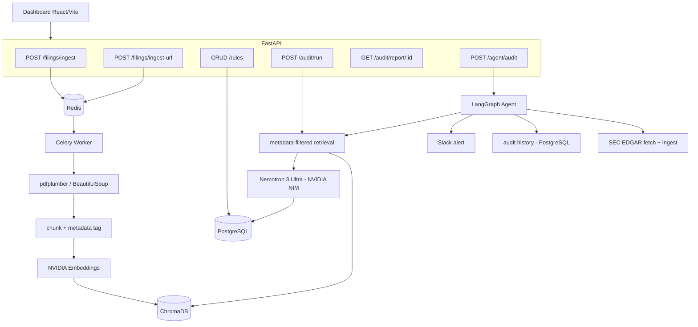
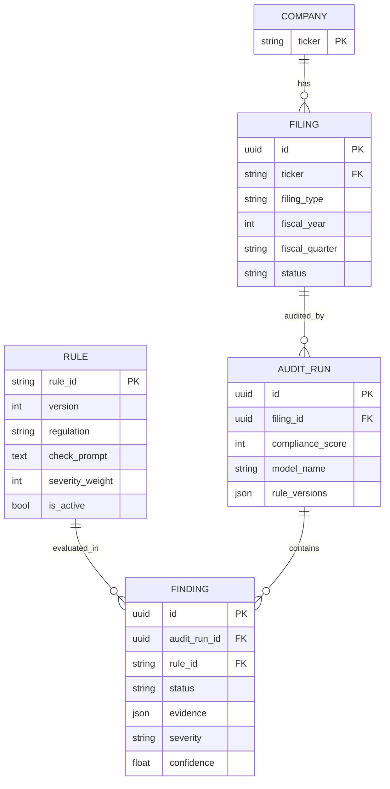

# Automated FinTech Corporate Compliance Auditor

Backend + minimal dashboard that ingests financial-sector filings (10-K/10-Q PDFs or SEC URLs), isolates data per company/period in ChromaDB, audits statements against API-managed compliance rules (SOX/AML/KYC) using **metadata-filtered RAG + structured LLM reasoning on NVIDIA NIM (Nemotron)**, produces risk-scored audit reports (JSON + PDF), and runs a LangGraph agent that fetches filings from SEC EDGAR, queries audit history, and sends Slack alerts on critical findings.

> **Scope:** built for **financial-sector** filings (banks, payments, fintechs) where AML/KYC/SOX disclosures apply (e.g. PayPal, Coinbase, SoFi, Robinhood).

## Stack
- **LLM (NVIDIA NIM)**: `nvidia/nemotron-3-ultra-550b-a55b` for compliance reasoning (controllable reasoning budget); provider-switchable to Anthropic/OpenAI via `LLM_PROVIDER`
- **Embeddings (NVIDIA NIM)**: `nvidia/nemotron-3-embed-1b` (2048-dim), passage/query aware
- **API**: FastAPI (async), Pydantic v2
- **Async jobs**: Celery + Redis
- **DBs**: PostgreSQL (rules, filings, audits, findings), ChromaDB (vectors + metadata)
- **RAG**: LangChain + ChromaDB, metadata-filtered retrieval, structured JSON findings
- **Agent**: LangGraph (SEC EDGAR fetch → ingest → audit → history → alert); `mcp.json` provided to expose the tools to MCP clients
- **Reports**: WeasyPrint (PDF) + JSON
- **Frontend**: React + Vite + TypeScript

## Quick start
```bash
cp .env.example .env          # fill in NVIDIA_API_KEY and API_KEY
docker compose up -d --build  # api, worker, postgres, redis, chromadb
docker compose exec api python scripts/seed.py   # seed rules + demo company
# API docs: http://localhost:8000/docs   |   health: http://localhost:8000/health
```
Dashboard (separate terminal):
```bash
cd frontend && npm install && npm run dev   # http://localhost:5173
```

## Architecture


## Data model


## Key design guarantees
- **Multi-tenant isolation (R2)**: retrieval applies a ChromaDB `where` filter on `ticker + filing_type + fiscal_year + fiscal_quarter` **before** vector similarity, so one company's query can never surface another's chunks. See `backend/tests/test_isolation.py`.
- **Idempotent ingestion (R1)**: deterministic chunk IDs + a unique `(ticker, filing_type, fiscal_year, fiscal_quarter)` constraint mean re-ingest upserts, never duplicates. PDF **and** HTML (SEC .htm) inputs supported.
- **Rule reproducibility (R3/R6)**: rule updates create a new immutable version; each audit snapshots `rule_versions` + `model_name` + model params.
- **Robust LLM output (R4)**: malformed output is retried once, then downgraded to `needs_review` (never silently dropped).
- **Best-effort alerting (R7)**: Critical findings trigger a Slack alert; failures are logged and never fail the audit. Side effects are triggered by orchestrator code, never directly by the LLM.

## Agent layer
A **LangGraph** state machine drives the autonomous flow: `fetch (SEC EDGAR) → ingest → audit → history → alert`. The three tools are implemented as direct integrations (SEC EDGAR via HTTP, audit history via SQL, Slack via the Web API); an **`mcp.json`** is included so the same tools can be exposed to MCP clients (e.g. Claude Desktop).

## One-command demo
```bash
docker compose up -d --build
docker compose exec api python scripts/seed.py       # seed rules + demo company
cd frontend && npm install && npm run dev            # http://localhost:5173
# In the dashboard: upload a fintech 10-K (PayPal / Coinbase PDF or SEC URL),
# wait for "indexed", then Run Audit -> score + findings + PDF report.
```
Agentic path (fetch straight from EDGAR):
```bash
curl -X POST http://localhost:8000/agent/audit \
  -H "X-API-Key: $API_KEY" -H "Content-Type: application/json" \
  -d '{"ticker":"PYPL"}'
```

## Tests
```bash
cd backend && pip install -e '.[dev]' && pytest       # all LLM/embedding/EDGAR/Slack calls mocked
cd frontend && npm ci && npm run test -- --run
```

## Environment
Copy `.env.example` to `.env` and set:
- `NVIDIA_API_KEY` — from build.nvidia.com (used for both chat + embeddings)
- `LLM_PROVIDER=nvidia`, `CHAT_MODEL`, `REASONING_BUDGET`, `ENABLE_THINKING`, `CHAT_TEMPERATURE`, `CHAT_TOP_P`
- `EMBEDDING_MODEL`, `EMBED_DIM`, `RETRIEVAL_TOP_K`
- `API_KEY` — protects write endpoints (`X-API-Key`); set the same value as the dashboard's `VITE_API_KEY`
- `SLACK_MCP_TOKEN`, `SLACK_CHANNEL` — optional alerting
- `SEC_EDGAR_USER_AGENT` — required by SEC EDGAR (descriptive contact)

Secrets live only in `.env` (gitignored); `.env.example` holds placeholders.
output example 

