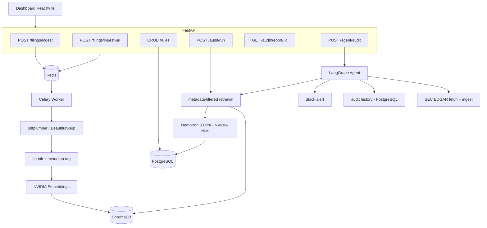
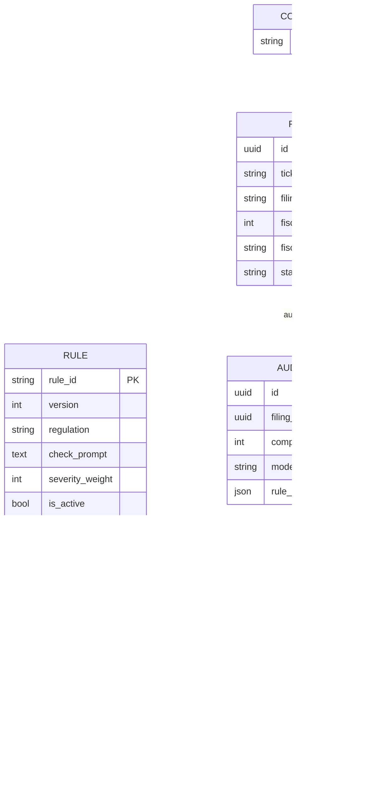

# Automated FinTech Corporate Compliance Auditor

Backend + minimal dashboard that ingests financial-sector filings (10-K/10-Q PDFs or SEC URLs), isolates data per company/period in ChromaDB, audits statements against API-managed compliance rules (SOX/AML/KYC) using **metadata-filtered RAG + structured LLM reasoning on NVIDIA NIM (Nemotron)**, produces risk-scored audit reports (JSON + PDF), and runs a LangGraph agent that fetches filings from SEC EDGAR, queries audit history, and sends Slack alerts on critical findings.

> **Scope:** built for **financial-sector** filings (banks, payments, fintechs) where AML/KYC/SOX disclosures apply (e.g. PayPal, Coinbase, SoFi, Robinhood).

## Stack
- **LLM (NVIDIA NIM)**: `nvidia/nemotron-3-ultra-550b-a55b` for compliance reasoning (controllable reasoning budget); provider-switchable to Anthropic/OpenAI via `LLM_PROVIDER`
- **Embeddings (NVIDIA NIM)**: `nvidia/nemotron-3-embed-1b` (2048-dim), passage/query aware
- **API**: FastAPI (async), Pydantic v2
- **Async jobs**: Celery + Redis
- **DBs**: PostgreSQL (rules, filings, audits, findings), ChromaDB (vectors + metadata)
- **RAG**: LangChain + ChromaDB, metadata-filtered retrieval, structured JSON findings
- **Agent**: LangGraph (SEC EDGAR fetch → ingest → audit → history → alert); `mcp.json` provided to expose the tools to MCP clients
- **Reports**: WeasyPrint (PDF) + JSON
- **Frontend**: React + Vite + TypeScript

## Quick start
```bash
cp .env.example .env          # fill in NVIDIA_API_KEY and API_KEY
docker compose up -d --build  # api, worker, postgres, redis, chromadb
docker compose exec api python scripts/seed.py   # seed rules + demo company
# API docs: http://localhost:8000/docs   |   health: http://localhost:8000/health
```
Dashboard (separate terminal):
```bash
cd frontend && npm install && npm run dev   # http://localhost:5173
```

## Architecture


## Data model


## Key design guarantees
- **Multi-tenant isolation (R2)**: retrieval applies a ChromaDB `where` filter on `ticker + filing_type + fiscal_year + fiscal_quarter` **before** vector similarity, so one company's query can never surface another's chunks. See `backend/tests/test_isolation.py`.
- **Idempotent ingestion (R1)**: deterministic chunk IDs + a unique `(ticker, filing_type, fiscal_year, fiscal_quarter)` constraint mean re-ingest upserts, never duplicates. PDF **and** HTML (SEC .htm) inputs supported.
- **Rule reproducibility (R3/R6)**: rule updates create a new immutable version; each audit snapshots `rule_versions` + `model_name` + model params.
- **Robust LLM output (R4)**: malformed output is retried once, then downgraded to `needs_review` (never silently dropped).
- **Best-effort alerting (R7)**: Critical findings trigger a Slack alert; failures are logged and never fail the audit. Side effects are triggered by orchestrator code, never directly by the LLM.

## Agent layer
A **LangGraph** state machine drives the autonomous flow: `fetch (SEC EDGAR) → ingest → audit → history → alert`. The three tools are implemented as direct integrations (SEC EDGAR via HTTP, audit history via SQL, Slack via the Web API); an **`mcp.json`** is included so the same tools can be exposed to MCP clients (e.g. Claude Desktop).

## One-command demo
```bash
docker compose up -d --build
docker compose exec api python scripts/seed.py       # seed rules + demo company
cd frontend && npm install && npm run dev            # http://localhost:5173
# In the dashboard: upload a fintech 10-K (PayPal / Coinbase PDF or SEC URL),
# wait for "indexed", then Run Audit -> score + findings + PDF report.
```
Agentic path (fetch straight from EDGAR):
```bash
curl -X POST http://localhost:8000/agent/audit \
  -H "X-API-Key: $API_KEY" -H "Content-Type: application/json" \
  -d '{"ticker":"PYPL"}'
```

## Tests
```bash
cd backend && pip install -e '.[dev]' && pytest       # all LLM/embedding/EDGAR/Slack calls mocked
cd frontend && npm ci && npm run test -- --run
```

## Environment
Copy `.env.example` to `.env` and set:
- `NVIDIA_API_KEY` — from build.nvidia.com (used for both chat + embeddings)
- `LLM_PROVIDER=nvidia`, `CHAT_MODEL`, `REASONING_BUDGET`, `ENABLE_THINKING`, `CHAT_TEMPERATURE`, `CHAT_TOP_P`
- `EMBEDDING_MODEL`, `EMBED_DIM`, `RETRIEVAL_TOP_K`
- `API_KEY` — protects write endpoints (`X-API-Key`); set the same value as the dashboard's `VITE_API_KEY`
- `SLACK_MCP_TOKEN`, `SLACK_CHANNEL` — optional alerting
- `SEC_EDGAR_USER_AGENT` — required by SEC EDGAR (descriptive contact)

Secrets live only in `.env` (gitignored); `.env.example` holds placeholders.

## Deploy online (free)

The whole system ships as one Docker Compose stack (`api`, `worker`, `postgres`,
`redis`, `chromadb`, `frontend`), so the simplest deployment is to run that stack
on a single host. The frontend container serves the built React app with **Nginx**
and reverse-proxies `/api` to the backend, so only one public port is needed.

> **Canonical architecture = Docker Compose.** The multi-service Compose stack
> (`docker-compose.yml`, hardened by `docker-compose.prod.yml`) is the source of
> truth. Each hosting option below is just a *deployment target* for that same
> stack. The Hugging Face target packages the identical services into a single
> container only because HF Spaces currently runs one container per Space — the
> code, data model, and services are unchanged.

**Production hardening already baked in:** Postgres/Redis/Chroma ports are bound to
`127.0.0.1` (never exposed publicly on the host), every service has
`restart: unless-stopped`, Alembic migrations run on `api` startup, and write
endpoints require `X-API-Key`.

### Recommended free path — Oracle Cloud Always Free VM + Compose
A single **Oracle Cloud Always Free** VM (Ampere A1 Arm — up to 4 OCPU / 24 GB RAM,
non-expiring) runs *every* feature — the Celery worker, ChromaDB, Postgres and
Redis included — at no cost. Two helper scripts in [`deploy/`](deploy/) automate it.

**Step 1 — create the VM (Oracle console):** launch an *Ampere A1* instance
(Ubuntu 22.04+ recommended; allocate the full free shape for comfortable builds).

**Step 2 — open the network (two layers — this is the #1 Oracle gotcha):**
1. *Cloud layer:* in the VCN **Security List / NSG**, add an **Ingress rule**:
   Source `0.0.0.0/0`, IP Protocol TCP, destination port **80** (and **443** for TLS).
2. *Host layer:* handled automatically by `oracle-setup.sh` below.

**Step 3 — bootstrap + deploy (on the VM):**
```bash
git clone <your-repo> && cd fintech
chmod +x deploy/*.sh

./deploy/oracle-setup.sh      # installs Docker + Compose, opens host firewall 80/443
#   log out and back in once so the 'docker' group applies

cp .env.example .env          # set NVIDIA_API_KEY, a strong API_KEY, CORS_ORIGINS
./deploy/deploy.sh            # builds + starts the prod stack, waits for health, seeds
```

`deploy.sh` uses the production overlay
[`docker-compose.prod.yml`](docker-compose.prod.yml): the dashboard is published
on port **80** (the only public entrypoint) and the API is **not** exposed to the
open internet — the frontend's Nginx reaches it over the internal compose network,
so `/docs` is reachable only via an SSH tunnel
(`ssh -L 8000:localhost:8000 <user>@<vm-ip>`). When it finishes, open
`http://<vm-public-ip>/`.

**Free HTTPS with no domain (recommended for a demo):** run the deploy with a
**Cloudflare Quick Tunnel** — it publishes a public `https://<random>.trycloudflare.com`
URL over an *outbound* connection, so you don't even need the port-80 ingress rule:
```bash
TUNNEL=1 ./deploy/deploy.sh      # prints the https://…trycloudflare.com URL at the end
```
The URL changes each time the tunnel restarts; for a stable custom domain use a
named Cloudflare Tunnel (needs a CF account + domain) or run Caddy/Traefik in
front of the `frontend` container, then set `CORS_ORIGINS` to that `https://…` URL.

**Reboots:** every service has `restart: unless-stopped` and Docker is enabled on
boot, so the whole stack (including the worker and tunnel) comes back automatically
after the VM restarts — no extra setup needed.

### 90-day free path — Google Cloud ($300 trial credit) + Compose
Google's free trial grants **$300 in credit for 90 days** (its card check is
usually smoother than Oracle's). Run the *same* Compose stack on a small VM — the
credit easily covers ~3 months of an always-on 4 GB VM (~$25/mo ≈ ~$75 total),
so it's ideal for a temporary live resume/GitHub link while you sort out a
permanent host.

> **Billing note (important):** a Compute Engine VM is billed for the time it is
> *running*, not per request — it consumes credit 24/7 **even with zero visitors**.
> That's fine here ($300 credit ≫ the ~$75 needed for 3 months), and when the trial
> ends or the credit is used up, GCP **suspends** resources rather than charging
> you (no auto-billing unless you manually upgrade). To stretch the credit, `stop`
> the VM when idle and `start` it before an interview — the public URL is down
> while it's stopped.

Steps (reuses the exact same scripts as the Oracle path):
1. Cloud Console → Compute Engine → Create instance: machine type **e2-medium**
   (2 vCPU / 4 GB), boot disk **Ubuntu 22.04**, 30 GB. Create.
2. SSH in (the browser **SSH** button, or `gcloud compute ssh`), then:
   ```bash
   git clone <your-repo> && cd fintech && chmod +x deploy/*.sh
   ./deploy/oracle-setup.sh       # generic Ubuntu + Docker bootstrap (works on GCP too)
   # log out/in once, then: cd fintech
   cp .env.example .env           # set NVIDIA_API_KEY and a strong API_KEY
   TUNNEL=1 ./deploy/deploy.sh     # free HTTPS via Cloudflare tunnel; prints the URL
   ```
   The Cloudflare tunnel is outbound, so you **don't** need to open any GCP VPC
   firewall rule. (Prefer plain HTTP on port 80? Add a VPC firewall rule for
   `tcp:80` and run `./deploy/deploy.sh` without `TUNNEL=1`.)

### Temporary path — AWS EC2 (signup credit) + Compose
New AWS accounts get **$100 credit (up to $200 after onboarding tasks), valid 12
months**. The free-tier micro instance (1 GB RAM) is **too small** for this stack,
so run a **t3.medium (4 GB, ~$30/mo)** — or a budget **t3.small (2 GB, ~$15/mo,
add swap)** — funded by that credit, which covers several months of an always-on
demo. No project/stack changes are needed: EC2 is just an Ubuntu VM, so the same
scripts as the Oracle/GCP paths apply.

> **Billing warning:** unlike Google's trial (which *suspends* resources), **AWS
> will charge your card** if the credit is used up or expires while the instance is
> running. It also bills for VM *uptime*, not requests (a running instance costs
> even with zero visitors). Immediately set a **Billing → Budgets** alarm (e.g. $5)
> and stop/terminate the instance when you're finished.

**Conserve credit with Stop/Start (recommended for an interview-only demo):**
Press **Stop** when idle and **Start** ~5 min before you present. While *stopped*
you pay **no compute** (the ~$30/mo drops to $0) — only the EBS root disk (~$2.4/mo,
which keeps your data) and the Elastic IP (~$3.6/mo). That's ≈ **$6/mo stopped**, so
the $100–200 credit lasts the full 12 months. On **Start** the whole stack
auto-recovers (every service is `restart: unless-stopped` and Docker starts on
boot) in ~2–3 minutes, and your data persists on the EBS volume. Keep the **Elastic
IP** so the link URL stays the same across stop/start.

Steps (same kit as Oracle/GCP):
1. EC2 → Launch instance: **Ubuntu 22.04**, type **t3.medium**, 30 GB gp3 disk;
   create/download a key pair.
2. Security group: allow inbound **TCP 22** (your IP) and **TCP 80** (`0.0.0.0/0`).
3. For a stable resume link, allocate an **Elastic IP** and associate it.
4. SSH in, then:
   ```bash
   git clone <your-repo> && cd fintech && chmod +x deploy/*.sh
   ./deploy/oracle-setup.sh      # generic Ubuntu + Docker bootstrap (works on EC2)
   # (t3.small only) add swap so it won't OOM:
   #   sudo fallocate -l 2G /swapfile && sudo chmod 600 /swapfile \
   #     && sudo mkswap /swapfile && sudo swapon /swapfile
   # log out/in once, then: cd fintech
   cp .env.example .env          # set NVIDIA_API_KEY and a strong API_KEY
   ./deploy/deploy.sh            # dashboard on port 80  ->  http://<elastic-ip>/
   ```
   Prefer HTTPS with no open port? Use `TUNNEL=1 ./deploy/deploy.sh` for a free
   Cloudflare tunnel instead of opening port 80.

### No-credit-card path — Hugging Face Spaces (single container)
When a card/identity check blocks the VM route, deploy the **same services** as a
single free Docker container on **Hugging Face Spaces** (no card, public HTTPS).
`supervisord` runs the full stack in one container (HF Spaces allows one container
per Space); the public port is `7860` and Nginx proxies `/api` to the backend.

```
                         Browser
                            │  (HTTPS, port 7860)
                    Hugging Face Space
                            │
                     Docker container
                            │
                        supervisord
      ┌───────────┬─────────┬──────────┬──────────┬──────────┐
    nginx        api      worker      redis     postgres    chroma
                  │
              LangGraph → LangChain → NVIDIA NIM (external)
```

This is the *same* codebase and data model as the canonical Compose stack (above),
just co-located in one container. Everything needed lives in
[`deploy/hf-space/`](deploy/hf-space/) (`Dockerfile`, `supervisord.conf`,
`nginx.conf`, `README.md`); the Dockerfile clones this repo at build time, so the
Space itself only holds those four files. See that folder's README for the
click-by-click steps. **Note:** free HF storage is ephemeral (Postgres/Chroma reset
on restart), but migrations + demo seed re-run on every boot, so it self-heals.

### Managed PaaS alternatives (mind the free-tier limits)
These are convenient but each has a catch for a stack with an always-on worker:

| Platform | Fits this stack? | Free-tier catch (verify before relying on it) |
|----------|------------------|-----------------------------------------------|
| [Render](https://render.com/docs/free) | Partially | Web services sleep after ~15 min idle; free Postgres is deleted ~30 days after creation; background workers (needed for Celery) are a paid plan. |
| [Railway](https://railway.app) | Yes | Only a small monthly trial credit — not free once the credit is used. |
| [Fly.io](https://fly.io) | Yes | Credit card required; free machines are small (~256 MB RAM), tight for Chroma + WeasyPrint. |
| Oracle Cloud Always Free | Yes | Card required at signup; genuinely free and non-expiring afterward. |

If you prefer the fully-managed split (no worker on a paid plan), the pieces also
run on free managed services: **Neon** (Postgres, persistent), **Upstash** (Redis),
**Chroma Cloud** (vectors), a static-site host for the frontend, plus a container
host that supports an always-on process for the worker. This needs a few connection
strings in `.env` but no code changes. *(Free-tier terms change often — the linked
docs are the source of truth. Content summarized for licensing compliance.)*

### Pre-flight checklist
- `API_KEY` set to a long random value (and matched by the dashboard's build arg).
- `CORS_ORIGINS` set to your real dashboard URL (only needed if the browser calls
  the API cross-origin; the bundled Nginx proxy keeps it same-origin).
- `NVIDIA_API_KEY` set; Slack/EDGAR values set if you use those features.
- Never commit `.env` (already gitignored). Rotate any key that has been shared.

output example 

